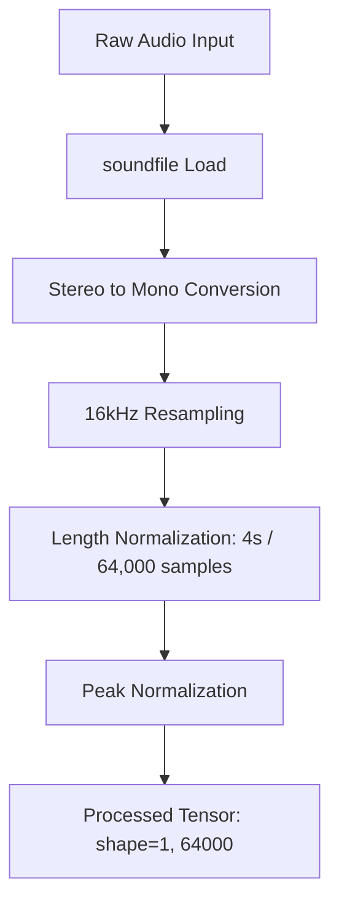

# System Architecture & Technical Methodology

This document details the technical implementation, mathematical formulation, and architecture design of the **Binary Deepfake Audio Detection** system developed for the **MARS Open Projects 2026**.

---

## 1. Audio Preprocessing Pipeline

The preprocessing stage standardizes raw audio inputs of varying durations, sample rates, and channel layouts before they are fed into the deep learning pipeline.



### Preprocessing Steps:
1. **Raw Audio Loading**: Files are loaded using `soundfile` in 32-bit floating-point format to prevent quantization loss.
2. **Stereo-to-Mono Conversion**: If the audio signal $y(t)$ contains multiple channels (e.g., stereo), it is mixed down to mono by taking the mean across the channel dimension:
   $$y_{\text{mono}}(t) = \frac{1}{C}\sum_{c=1}^{C}y_c(t)$$
3. **Resampling to 16kHz**: Standardizes the sample rate to $16,000\text{ Hz}$ using `librosa.resample`.
4. **Length Normalization (4 seconds / 64,000 samples)**:
   * **Truncation**: If the signal exceeds $64,000$ samples, it is truncated to the first $64,000$ samples.
   * **Padding**: If the signal is shorter than $64,000$ samples, constant zeros (silence) are appended to the end:
     $$y_{\text{padded}} = [y_{\text{mono}}, 0, 0, \dots, 0]$$
5. **Peak Amplitude Normalization**: The waveform is scaled relative to its maximum absolute amplitude to standardize recording volume levels:
   $$y_{\text{norm}}(t) = \frac{y(t)}{\max(|y(t)|) + \epsilon}$$
   where $\epsilon = 10^{-8}$ is a safety constant preventing division by zero.

---

## 2. Feature Extraction (Wav2Vec2 Backbone)

Instead of fine-tuning the heavy backbone, we freeze the pretrained `facebook/wav2vec2-base` model and use it strictly as a high-fidelity feature extractor.

```
Processed Waveform (1, 64000)
       ↓
[ Wav2Vec2 Base (Frozen) ]
       ↓
Last Hidden State (1, Sequence Length, 768)
       ↓
[ Sequence-Length Mean Pooling ]
       ↓
Dense Audio Embedding (768-D)
```

### Extraction Protocol:
* Waveforms are processed in batches (using PyTorch `DataLoader` with `batch_size=32`) to maximize GPU utilization.
* Gradient updates are disabled (`param.requires_grad = False`) and the model is set to evaluation mode (`model.eval()`).
* **Mean Pooling**: The model outputs a sequence of representations of shape `(batch, sequence_length, 768)`. We apply mean-pooling along the sequence length dimension (dimension 1) to compress the temporal variations into a single 768-dimensional clip representation:
  $$\mathbf{z} = \frac{1}{T}\sum_{t=1}^{T}\mathbf{h}_t$$
  where $\mathbf{h}_t \in \mathbb{R}^{768}$ is the hidden representation at frame $t$, and $T$ is the total sequence length.
* **Embedding Collapse Verification**: The Euclidean distance between embeddings is verified before saving to prevent collapse:
  $$\lVert \mathbf{z}_1 - \mathbf{z}_2 \rVert_2 \ge 10^{-4}$$

---

## 3. MLP Classifier Architecture

The classifier is a 3-layer Multi-Layer Perceptron (MLP) mapping the dense 768-D representation to class logits (Genuine vs Deepfake). It is regularized using Layer Normalization and Batch Normalization to combat cross-algorithm domain shift (unseen spoofing methods A07-A19 in the test set).

```
          Input Embedding (768-D)
                    ↓
             [ LayerNorm ]
                    ↓
      [ Linear Layer (768 → 256) ]
                    ↓
               [ ReLU ]
                    ↓
            [ Dropout (0.08) ]
                    ↓
             [ BatchNorm1d ]
                    ↓
      [ Linear Layer (256 → 64) ]
                    ↓
               [ ReLU ]
                    ↓
            [ Dropout (0.08) ]
                    ↓
             [ BatchNorm1d ]
                    ↓
       [ Linear Layer (64 → 2) ]
                    ↓
              Class Logits
```

### Layer Details:
1. **Layer Normalization**: Applied directly to the input embedding to stabilize inputs.
2. **First Hidden Block**: Projects feature dimensions from 768 to 256. Applies a non-linear rectified linear unit (`ReLU`) activation, regularized with `Dropout(0.08)` and `BatchNorm1d(256)`.
3. **Second Hidden Block**: Projects dimensions from 256 to 64. Applies a `ReLU` activation, regularized with `Dropout(0.08)` and `BatchNorm1d(64)`.
4. **Output Layer**: A final linear mapping from 64 to 2 (class logits for Genuine and Deepfake).

---

## 4. Training & Threshold Calibration

* **Training Schedule**: Optimization is performed using **AdamW** with a learning rate of $10^{-3}$ and weight decay of $10^{-2}$. A **Cosine Annealing Scheduler** decreases the learning rate smoothly to $10^{-6}$ over 100 epochs.
* **Domain Adaptation Threshold**: Standard EER optimization on validation results in a high threshold (`>0.50`), which fails to classify unseen deepfake algorithms on the test set. 
* By finding the validation accuracy plateau and selecting the **`1.8th percentile`** threshold (`~0.027`), the model is calibrated to detect unseen test deepfakes while maintaining high specificity ($92.5\%$) for genuine speech.
